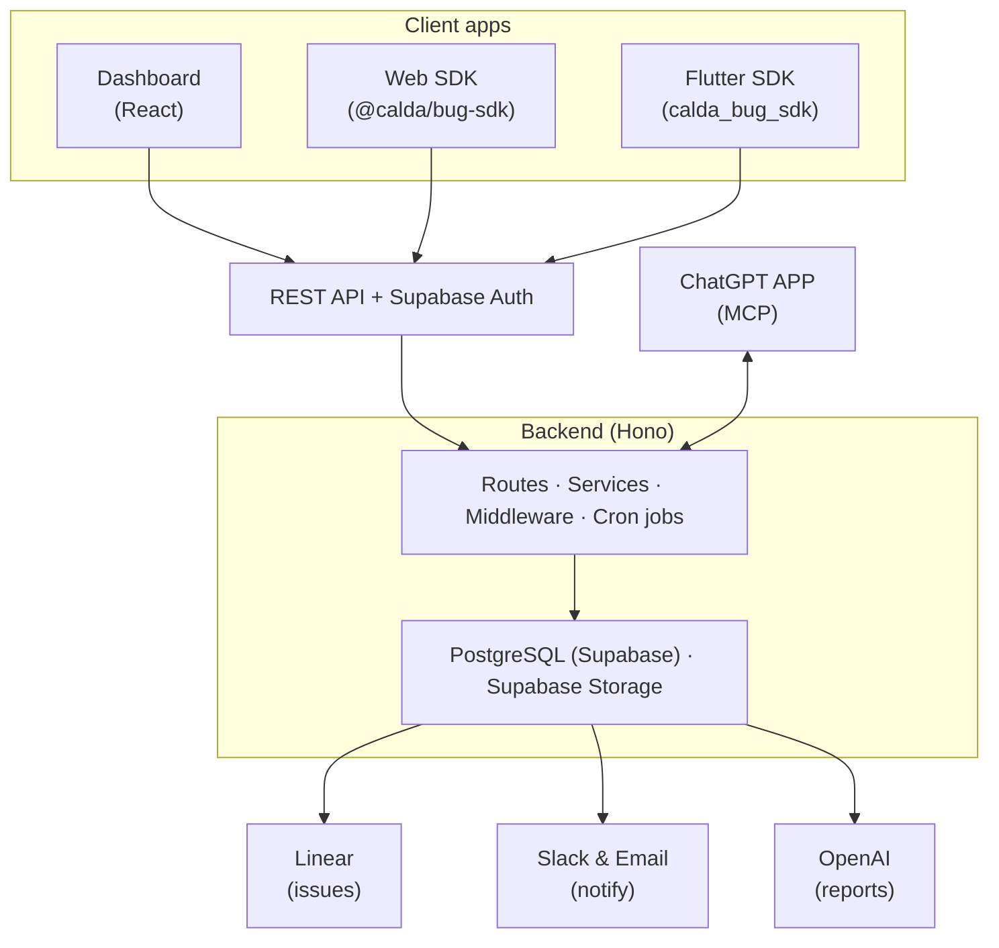

## System overview

BugSense consists of four repositories that work together:

- **Dashboard** — React SPA for admins and clients to manage projects, issues, and reports.
- **Web SDK** — npm package that adds a floating bug-report widget to any web app.
- **Flutter SDK** — Dart package that adds a floating bug-report widget to Flutter apps.
- **Backend** — Hono API server handling auth, data, Linear sync, AI report generation, and ChatGPT MCP integration.
- **ChatGPT** — Connects via MCP protocol with OAuth, letting users query projects and issues through natural language.

## Tech stack

### Backend

| Layer | Technology |
|-------|------------|
| **Language** | TypeScript |
| **Runtime** | Node.js |
| **Framework** | [Hono](https://hono.dev) 4.x |
| **Database** | PostgreSQL via [Supabase](https://supabase.com) |
| **ORM** | [Drizzle ORM](https://orm.drizzle.team) |
| **Auth** | Supabase Auth (JWT) |
| **Email** | [Brevo](https://www.brevo.com) (Sendinblue) |
| **Issue tracking** | [Linear](https://linear.app) API + OAuth |
| **Notifications** | [Slack](https://api.slack.com) Bot API |
| **AI** | OpenAI (GPT-4o-mini) |
| **Storage** | Supabase Storage |

### Dashboard

| Layer | Technology |
|-------|------------|
| **Framework** | React 19 + Vite 7 |
| **Routing** | React Router 7 |
| **Styling** | Tailwind CSS 4 + shadcn/ui |
| **Server state** | TanStack Query 5 |
| **Rich text** | Tiptap |
| **Auth** | Supabase Auth (JWT via REST) |

### SDKs

| SDK | Platform | Package |
|-----|----------|---------|
| **Web** | Browser / Next.js | `@calda/bug-sdk` (TypeScript) |
| **Flutter** | iOS / Android / Web | `calda_bug_sdk` (Dart) |

Both SDKs share the same report payload schema and capture similar telemetry (logs, errors, network, navigation, breadcrumbs).

## Key integrations flow

### Linear sync

BugSense maintains bidirectional sync with Linear:

1. **Outbound** — When a client creates an issue or comment in BugSense, it's pushed to Linear via the Linear API.
2. **Inbound** — Linear sends webhook events (issue updates, new comments, attachments) to `/api/v1/webhooks/linear`, which updates the local database.

### Cron jobs

Scheduled tasks run via Supabase `pg_cron` and call internal API endpoints with a shared `CRON_SECRET`:

| Job | Schedule | Endpoint |
|-----|----------|----------|
| Weekly client report | Mondays 09:00 UTC | `POST /api/v1/jobs/weekly-client-report` |
| Slack issue digest | Every 30 minutes | `POST /api/v1/jobs/slack-issue-digest` |
| Email comments digest | Every 30 minutes | `POST /api/v1/jobs/email-comments-digest` |
